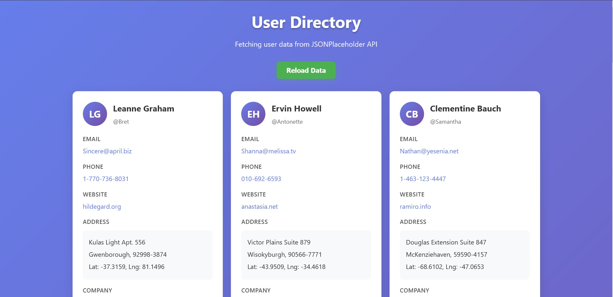
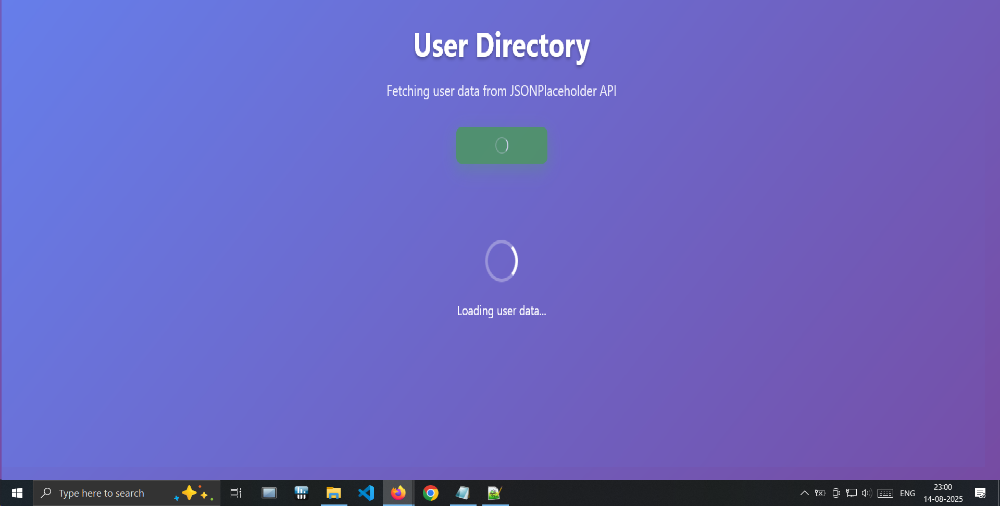
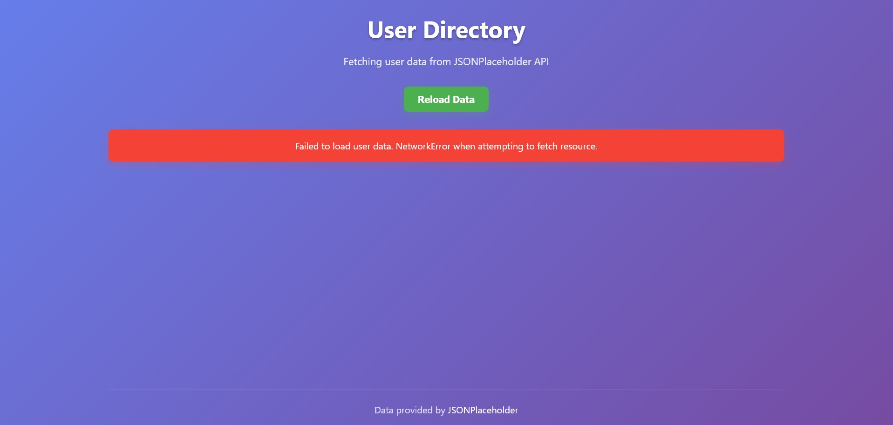

# User Data Fetcher 👥

A modern, responsive web application that fetches and displays user data from the JSONPlaceholder API using vanilla JavaScript and the Fetch API. Features elegant error handling, loading states, and a clean user interface.

## 🌟 Features

- **Real-time Data Fetching**: Retrieves user data from JSONPlaceholder API
- **Responsive Design**: Works seamlessly on desktop, tablet, and mobile devices
- **Error Handling**: Comprehensive error handling for network issues, timeouts, and server errors
- **Loading States**: Visual feedback during data fetching with spinners and animations
- **Offline Detection**: Monitors connection status and provides appropriate feedback
- **Modern UI/UX**: Clean, card-based layout with smooth animations and hover effects
- **Accessibility**: Keyboard navigation support and semantic HTML structure
- **Timeout Protection**: 10-second timeout to prevent hanging requests

## 📸 Screenshots

### Desktop View

*Main interface showing user cards in a responsive grid layout*

### Loading State

*Loading animation displayed while fetching data*

### Error Handling

*Error message shown when network issues occur*

## 🚀 Getting Started

### Prerequisites
- A modern web browser (Chrome, Firefox, Safari, Edge)
- Local web server (optional, for CORS-free development)

### Installation

1. **Clone the repository**
   ```bash
   git clone https://github.com/yourusername/user-data-fetcher.git
   cd user-data-fetcher
   ```

2. **Open the application**
   - **Option 1**: Open `index.html` directly in your browser
   - **Option 2**: Use a local server (recommended)
     ```bash
     # Using Python
     python -m http.server 8000
     
     # Using Node.js
     npx serve .
     
     # Using PHP
     php -S localhost:8000
     ```

3. **Access the application**
   Navigate to `http://localhost:8000` in your browser


## 🔧 Technical Implementation

### API Integration
- **Endpoint**: `https://jsonplaceholder.typicode.com/users`
- **Method**: GET request using Fetch API
- **Timeout**: 10-second timeout protection
- **Error Handling**: Network errors, HTTP errors, and timeout handling

### User Interface
- **Grid Layout**: CSS Grid for responsive card arrangement
- **Animations**: CSS animations and transitions for smooth UX
- **Loading States**: Visual feedback during API calls
- **Error Messages**: User-friendly error notifications

### Data Display
Each user card shows:
- Name and username with avatar initials
- Email (clickable mailto link)
- Phone (clickable tel link)
- Website (clickable external link)
- Complete address with coordinates
- Company information with catchphrase

## 🧪 Testing

### Manual Testing Scenarios

1. **Normal Operation**
   - Load the page and verify users display correctly
   - Click reload button to refresh data

2. **Network Error Simulation**
   - Disconnect internet connection
   - Reload page or click refresh button
   - Verify error message appears

3. **Mobile Responsiveness**
   - Test on various screen sizes
   - Verify layout adapts appropriately

4. **Error Recovery**
   - Start with no internet connection
   - Reconnect internet
   - Verify automatic data loading
