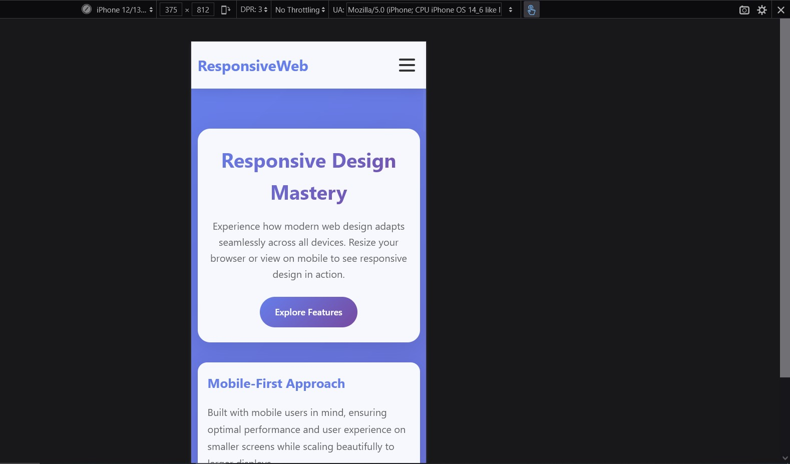

# Responsive Web Design Demo

A comprehensive demonstration of modern responsive web design principles, showcasing how to create mobile-friendly websites that adapt seamlessly across all device sizes.

## 🚀 Live Demo

View the responsive webpage and resize your browser window or test on different devices to see the responsive behavior in action.

## 📱 Features

- **Mobile-First Design**: Optimized for mobile devices with progressive enhancement
- **Responsive Navigation**: Collapsible hamburger menu for mobile devices
- **Flexible Grid Layouts**: Auto-adjusting content grids using CSS Grid and Flexbox
- **Scalable Typography**: Font sizes that adapt proportionally across devices
- **Touch-Friendly Interface**: Properly sized interactive elements for mobile
- **Cross-Browser Compatible**: Tested across modern browsers
- **Performance Optimized**: Efficient CSS with minimal overhead

## 🛠 Key Technologies

- **HTML5**: Semantic markup structure
- **CSS3**: Advanced layout techniques and media queries
- **Vanilla JavaScript**: Interactive functionality without dependencies
- **CSS Grid & Flexbox**: Modern layout systems
- **CSS Custom Properties**: Maintainable styling approach

---

## 📚 CSS Concepts Explained

### 1. Media Queries

Media queries are the foundation of responsive design, allowing different styles based on device characteristics.

```css
/* Mobile-first approach */
@media screen and (max-width: 768px) {
    .container {
        padding: 0 15px;
    }
}

@media screen and (max-width: 480px) {
    .hero h1 {
        font-size: 2rem;
    }
}
```

**Key Concepts:**
- **Mobile-first**: Start with mobile styles, then enhance for larger screens
- **Breakpoints**: Strategic screen sizes where layout changes occur
- **max-width vs min-width**: Choose based on your design approach

### 2. Responsive Units

Different CSS units behave differently across screen sizes:

```css
/* Fixed units - avoid for responsive design */
.fixed-width { width: 300px; }

/* Relative units - preferred for responsive design */
.fluid-width { width: 100%; }        /* Percentage of parent */
.scalable-text { font-size: 1.2rem; } /* Relative to root font size */
.viewport-based { width: 50vw; }      /* 50% of viewport width */
```

**Unit Types:**
- **px**: Fixed pixels - use sparingly
- **%**: Percentage of parent element
- **rem**: Relative to root font size (scalable)
- **em**: Relative to parent font size
- **vw/vh**: Viewport width/height percentage
- **vmin/vmax**: Viewport minimum/maximum dimension

### 3. CSS Grid for Responsive Layouts

CSS Grid provides powerful layout capabilities with built-in responsiveness:

```css
.features {
    display: grid;
    grid-template-columns: repeat(auto-fit, minmax(300px, 1fr));
    gap: 2rem;
}
```

**Key Functions:**
- **auto-fit**: Automatically fits columns to available space
- **minmax(300px, 1fr)**: Minimum 300px width, maximum available space
- **gap**: Consistent spacing between grid items
- **1fr**: Fractional unit representing available space

### 4. Flexbox for Component Layout

Flexbox excels at component-level layouts and alignment:

```css
.stats {
    display: flex;
    justify-content: space-around;
}

/* Mobile: Stack vertically */
@media (max-width: 768px) {
    .stats {
        flex-direction: column;
        gap: 2rem;
    }
}
```

**Flexbox Properties:**
- **flex-direction**: Row or column layout
- **justify-content**: Main axis alignment
- **align-items**: Cross axis alignment
- **gap**: Spacing between flex items

### 5. Container Queries and Max-Width

Prevent content overflow with proper container management:

```css
.container {
    max-width: 1200px;  /* Prevents excessive width on large screens */
    margin: 0 auto;     /* Centers the container */
    padding: 0 20px;    /* Breathing room on sides */
    width: 100%;        /* Full width up to max-width */
}
```

### 6. Responsive Images and Media

Ensure images scale properly without breaking layout:

```css
img, video, iframe {
    max-width: 100%;    /* Never exceed container width */
    height: auto;       /* Maintain aspect ratio */
}

.image-item {
    aspect-ratio: 16/9; /* Modern way to maintain proportions */
    overflow: hidden;   /* Clip content that exceeds bounds */
}
```

### 7. Typography Scaling

Create harmonious typography that scales across devices:

```css
/* Base desktop typography */
.hero h1 { font-size: 3.5rem; }

/* Tablet adjustment */
@media (max-width: 768px) {
    .hero h1 { font-size: 2.5rem; }
}

/* Mobile adjustment */
@media (max-width: 480px) {
    .hero h1 { font-size: 2rem; }
}
```

### 8. Responsive Navigation Patterns

Transform desktop navigation for mobile use:

```css
/* Desktop: Horizontal navigation */
nav ul {
    display: flex;
    gap: 2rem;
}

/* Mobile: Hidden by default, vertical when active */
@media (max-width: 768px) {
    nav ul {
        display: none;
        flex-direction: column;
        position: absolute;
        top: 100%;
        left: 0;
        right: 0;
    }
    
    nav ul.active {
        display: flex;
    }
}
```



### 9. Box Model and Overflow Control

Prevent layout breaking and unwanted scrollbars:

```css
* {
    box-sizing: border-box; /* Include padding/border in width calculations */
}

body {
    overflow-x: hidden;     /* Prevent horizontal scrolling */
}
```


### 10. Performance Considerations

Optimize for mobile performance:

```css
/* Use transform for animations (GPU accelerated) */
.card:hover {
    transform: translateY(-5px);
}

/* Efficient transitions */
.element {
    transition: transform 0.3s ease;
}

/* Backdrop-filter for modern glass effects */
.glassmorphism {
    backdrop-filter: blur(10px);
}
```

---

## 🎯 Responsive Design Best Practices

### Breakpoint Strategy
```css
/* Mobile First Breakpoints */
/* Base styles: 0px and up (mobile) */

/* Small tablets and large phones */
@media (min-width: 480px) { }

/* Tablets */
@media (min-width: 768px) { }

/* Small desktops */
@media (min-width: 1024px) { }

/* Large desktops */
@media (min-width: 1200px) { }
```

### Mobile-First Approach Benefits:
1. **Performance**: Mobile users get optimized code first
2. **Progressive Enhancement**: Add complexity for larger screens
3. **Maintainability**: Easier to enhance than to strip down
4. **SEO**: Mobile-first indexing by search engines

### Common Responsive Patterns:

#### Column Drop
```css
.container {
    display: grid;
    grid-template-columns: 1fr;
}

@media (min-width: 768px) {
    .container {
        grid-template-columns: 1fr 1fr;
    }
}

@media (min-width: 1024px) {
    .container {
        grid-template-columns: 1fr 2fr 1fr;
    }
}
```

#### Mostly Fluid
```css
.content {
    width: 100%;
    max-width: 1200px;
    margin: 0 auto;
    padding: 0 20px;
}
```

#### Layout Shifter
```css
.sidebar {
    order: 2;
}

@media (min-width: 768px) {
    .sidebar {
        order: 1;
    }
}
```

---

## 🔧 Implementation Guide

### 1. Start with the Viewport Meta Tag
```html
<meta name="viewport" content="width=device-width, initial-scale=1.0">
```

### 2. Use Relative Units
- Prefer `rem` for typography
- Use `%` for widths
- Consider `vw`/`vh` for full-screen elements

### 3. Test Across Devices
- Chrome DevTools device emulation
- Real device testing
- Browser resize testing

### 4. Optimize Touch Targets
- Minimum 44px × 44px for touch elements
- Adequate spacing between interactive elements
- Consider thumb-friendly navigation placement

### 5. Performance Optimization
- Minimize CSS file size
- Use efficient selectors
- Leverage browser caching
- Optimize images with responsive techniques

---

## 📊 Browser Support

This implementation uses modern CSS features with broad support:

- **CSS Grid**: IE 11+ (with prefixes), all modern browsers
- **Flexbox**: IE 11+, all modern browsers  
- **Media Queries**: IE 9+, all modern browsers
- **Viewport Units**: IE 9+, all modern browsers
- **rem Units**: IE 9+, all modern browsers

---

## 🚀 Getting Started

1. **Clone or download** the HTML file
2. **Open in a browser** to see the responsive behavior
3. **Resize the window** or use browser DevTools to test different screen sizes
4. **Examine the CSS** to understand the responsive techniques
5. **Modify and experiment** with different breakpoints and layouts

---
