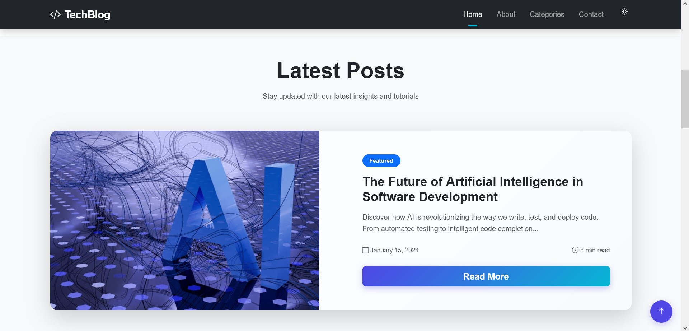
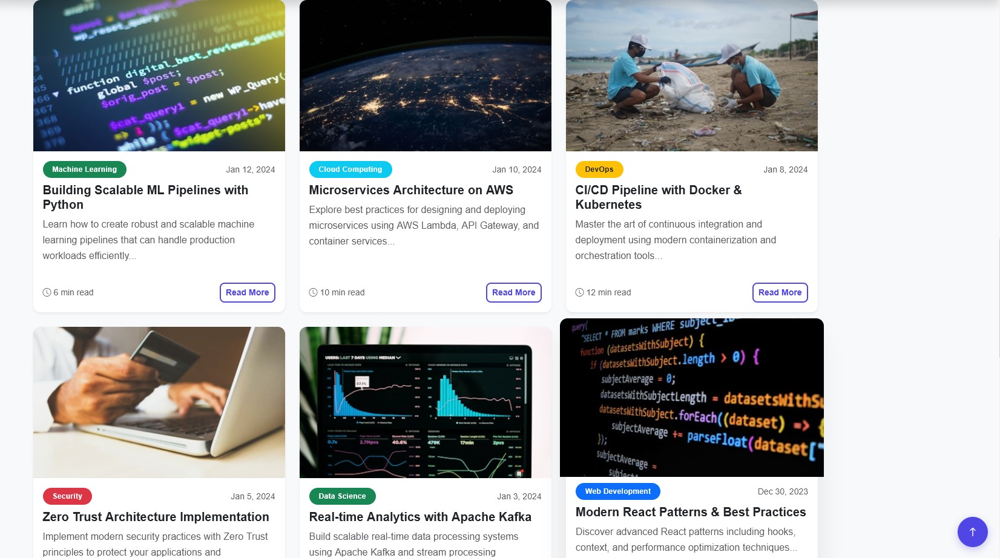
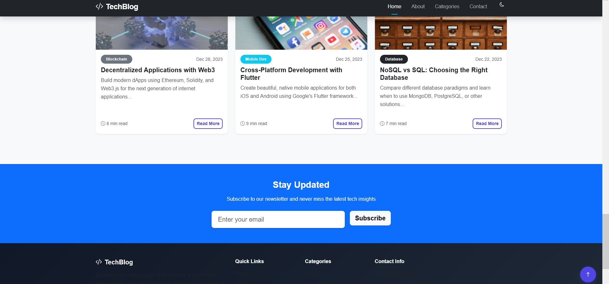

# TechBlog - Modern Responsive Blog Layout

A modern, responsive blog layout built with Bootstrap 5, featuring a clean design and interactive elements perfect for technology and development content.


## 🚀 Features

### Core Features
- **Responsive Design**: Fully responsive layout that works on all device sizes
- **Modern UI/UX**: Clean, contemporary design with smooth animations
- **Bootstrap 5**: Built with the latest Bootstrap framework
- **Interactive Elements**: Hover effects, animations, and user interactions
- **SEO Friendly**: Semantic HTML structure and proper meta tags

### Interactive Features
- **Smooth Scrolling**: Navigate between sections with smooth scrolling
- **Load More Posts**: Dynamic loading of additional blog posts
- **Newsletter Subscription**: Working newsletter signup form
- **Scroll to Top**: Convenient scroll-to-top button
- **Navbar Effects**: Dynamic navbar with scroll effects
- **Card Animations**: Smooth hover animations on blog cards
- **Theme Support**: Built-in dark/light theme toggle capability

### Blog Components
- **Hero Section**: Eye-catching gradient hero with call-to-action
- **Featured Post**: Highlighted main article with larger layout
- **Blog Cards**: Responsive card grid for blog posts
- **Categories**: Color-coded category badges
- **Read Time**: Estimated reading time for each post
- **Social Sharing**: Social media integration ready
- **Newsletter**: Email subscription section


## 🛠️ Technologies Used

- **HTML5**: Semantic markup structure
- **CSS3**: Custom styling with modern features
- **Bootstrap 5.3.2**: Responsive framework
- **Bootstrap Icons**: Icon library
- **JavaScript ES6+**: Interactive functionality
- **CSS Grid & Flexbox**: Advanced layouts


### Required Images
1. **Hero Background** 


2. **Featured Post Image** 


3. **Logo** (`200x50px`): Brand logo for navbar


### Recommended Image Categories
- **AI/Machine Learning**: Technology, robots, neural networks
- **Cloud Computing**: Servers, cloud infrastructure, data centers
- **DevOps**: Pipelines, automation, containers
- **Security**: Locks, shields, cybersecurity concepts
- **Data Science**: Charts, graphs, data visualization
- **Web Development**: Code, browsers, responsive design

## 🚀 Getting Started

### Prerequisites
- Modern web browser
- Text editor/IDE
- Local web server (optional, for development)


## 🎨 Customization

### Color Scheme
Modify the CSS variables in `styles.css`:

```css
:root {
    --primary-color: #4f46e5;    /* Primary brand color */
    --secondary-color: #06b6d4;  /* Secondary accent color */
    --accent-color: #f59e0b;     /* Highlight color */
    --dark-color: #1f2937;       /* Dark elements */
    --light-color: #f8fafc;      /* Light backgrounds */
    --text-muted: #6b7280;       /* Muted text */
}
```

### Content Customization
1. **Blog Posts**: Update the card content in the HTML
2. **Categories**: Add or modify category badges and colors
3. **Navigation**: Update menu items and links
4. **Footer**: Add your contact information and social links
5. **Newsletter**: Connect to your email service provider

### Adding New Features
The JavaScript is modular and easy to extend:
- Add new animations in the CSS
- Extend the `loadMorePosts` function for API integration
- Add search functionality using the provided framework
- Implement theme switching with the theme toggle

## 📱 Responsive Breakpoints

- **Mobile**: < 576px
- **Tablet**: 576px - 768px
- **Desktop**: 768px - 992px
- **Large Desktop**: > 992px
